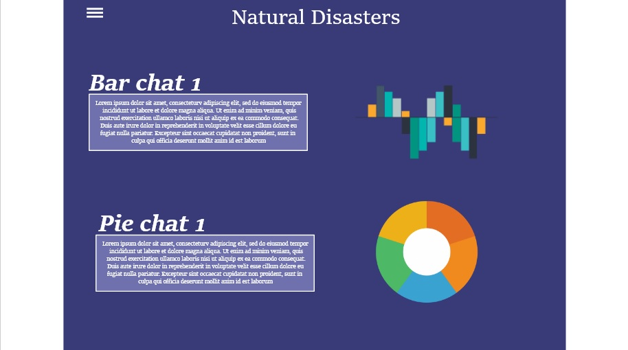
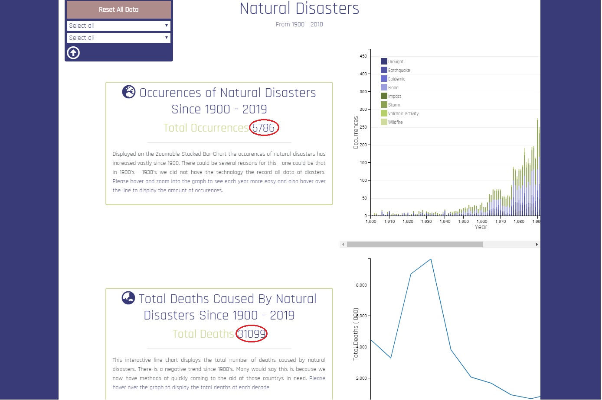
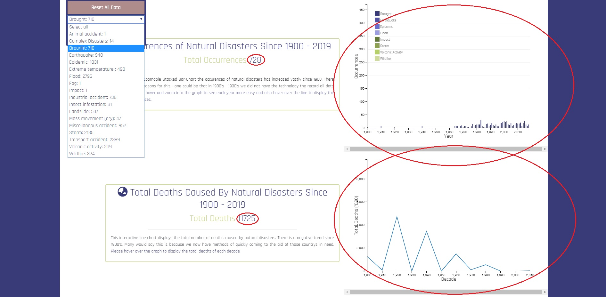

# Natural Disasters Interactive Database

#### Site Address: https://ewanlockwood.github.io/interactice-frontend/

-----

## Table of Contents

1. [Overview](#overview)

2. [UX Design Procedure](#ux)
    - [Strategy Plane](#strategy-plane)
    - [Scope Plane](#scope-plane)

3. [Features](#features)
    - [Existing Features](#existing-features)
    - [Features Left to Implement](#features-left-to-implement)
    
4. [Technologies Used](#technologies-used)

5. [Testing](#testing)

6. [Deployment](#deployment)

7. [Credits](#credits)

-----

## Overview

This is an Interactive Data Dashboard that displays the effects of Disasters since 1900's.
 You can find out the occurences of each disaster type, total deaths caused and money speny by each country.

 
-----


## UX

## Strategy Plane

The inspiration for this project came from <a href="https://ourworldindata.org/natural-disasters"> Our World In Data </a> they had a vast amount
of dashboards but I decided to use the Natural Disasters database from <a href="https://www.emdat.be/"> The International Disaster Database</a>.

This Interactive Data Dashboard was built to display and visualise data for the end user to interact with charts to further
improve their knowledge on the effects of disasters and intened user of this site was mainly students for educational purposes or
people genrally interested in this topic.

## Scope Plane

Taking into account that that users will visit my site to look specifically on visualised data I want the main attention
focusing on the graphs themselves. Therefore, little content as possible is required to suffice the goal.


## Structure Plane

Before I started my project I created a mockup using Adobe XD (image below). I understood that this was the foundations of my
site as other ideas would come to mind when progressing with the project.


<br>

This is the overall structure I wanted as the content is minimal with only the chart description and charts availble for the user to look at. Also, I want 
padding around each peice of content to create more of a spacious effect so the user isnt overwhemled with infomation or content.

## Interaction Design

Apat from the interaction with each chart. The menu situated top left was implement to help catergorise the charts but initally it planned to add a link to each graph on
the page.

For Example, below you can see when I change the first drop downmenu to a specific type of disater the charts will change respectfully.



 

## Surface Plane

The typogragphy was found on google fonts and I chose the font <a href="https://fonts.google.com/specimen/Rajdhani">Rajdhani</a> as it
stood out to me the most, it has a nice futuristic effect with soft-rounded edges.

The color scheme I chose for this project is seen below:
Hexcodes:
 - #cedb9c
 - #393b79


### Development

#### IDE
Cloud9 IDE was the Integrated development enviroment for this website.

#### Version Control
Git Hub was the version control station for this website which was used to manage and store versions of the source code.

-----
## Features
### Existing Features


-----

## Technologies Used


### HTML
To provide the structure of the webiste.

### CSS
To make the website look better visually.

### Bootstrap (https://getbootstrap.com/)
To use their responsive grid system and also their sass variables where certain variables have an established design to it already.

### DC (https://dc-js.github.io/dc.js/)
To display interactive charts from datasets.
 
### D3 (https://d3js.org/)
To render each graph

### Crossfilter (http://crossfilter.github.io/crossfilter/)
To create an interaction with all graphs in the dataset.
 

-----

## Testing

## Manual Testing

1. Both Modal "Close" Button and "X" Button successfully close the modal.

2. The "Reset all Data" Button successfully resets all data on each charts.

3. Both Drop Down Menu's successfully change all graphs accordingly.

4. Each Chart Interacts with each other successfully.
-----

## Deployment

The version control and deployment of this project is based on Git Hub. After every session I push the local code within Cloud9 into my GIT HUB repository.

This is my procedure: 

After I have finished working on the files in my IDE I would open the terminal and do the following commands to push the updated files across to the repository on GitHub

``` $git add . ```

```$git commit -m "describe the stage I am at"```

```git push -u origin master```

I would now ```$git status``` to check if everything is finished and then look at the repository to see there aswell.

-----

## Credits
### Content
All data came from https://emdat.be.
All Icons came from https://fontawesome.com/.
The main font was found at https://fonts.google.com/specimen/Rajdhani.
### Media
